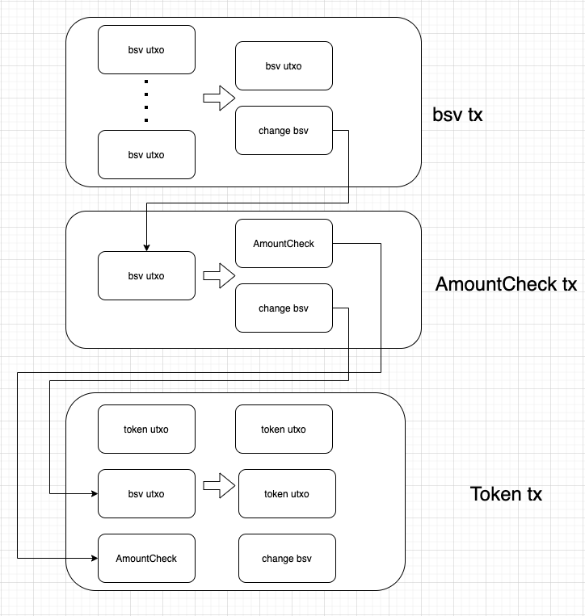

# farmServer接口

## 接口地址

- 主网: https://api.tswap.io/farm
- 测试网: https://api.tswap.io/farm/test

## 接口介绍

## 1. 获取所有的farm对

### Request
- Method: **GET**
- URL: ```/allpairs?address=mzJR1zKcZCZvMJj87rVqmFFxmaVEe62BBW```
> * address: 用户地址。

### Response
```
{
    "code": 0,
    "data": {
        "tbsv-test": {
            "token": {
                "rabinApis": ["https://s1.satoplay.com", "https://satotx.showpay.top", "https://satotx.volt.id", "https://satotx.metasv.com", "https://satotx.tswap.io"],
                "symbol": "tbsv/test",
                "tokenID": "dbd8ac021f83dc16e363520171177e7fcc401de7",
                "genesisHash": "ac7ceab3809fb68b7dc9b40e1c6cacf6ccb68558",
                "codeHash": "777e4dd291059c9f7a0fd563f7204576dcceb791",
                "decimal": 8
            },
            "rewardToken": {
                "rabinApis": ["https://s1.satoplay.com", "https://satotx.showpay.top", "https://satotx.volt.id", "https://satotx.metasv.com", "https://satotx.tswap.io"],
                "symbol": "test",
                "tokenID": "e616a7e2367f640485e8f9148a0320e4a71ab83f",
                "genesisHash": "0a1387f738b73e844e9ea0c5b0ae7eb3cbdec575",
                "codeHash": "777e4dd291059c9f7a0fd563f7204576dcceb791",
                "decimal": 8
            },
            "rewardAmountFactor": "100000000",
            "rewardAmountPerBlock": "100000000",
            "lastRewardBlock": "699815",
            "poolTokenAmount": "18000",
            "accPoolPerShare": "102999999999999",
            "addressCount": 100, 
            "lockedTokenAmount": "10000",
            "rewardTokenAmount": "10000",
            "farmCodeHash":"0d90001629d60c20fd9e95fcb99daaef12d063df",
            "farmID":"ba2b070b68e43a2301aedde0557db91af662ad73"
    }
}
```

code为0时，表示正常返回data。code为1时，表示由错误。错误信息在msg中。
> * token: 需要进行质押的token信息。
> * rewardToken: 质押token后获得的奖励token信息。
> * rewardAmountFactor: 用于计算用户的奖励。
> * rewardAmountPerBlock是当前farm池每个区块所产生的奖励token数量。
> * lastRewardBlock: 上次更新操作时的block高度。
> * poolTokenAmount: 当前farm池质押的token数量。
> * accPoolPerShare: 累计的奖励，用于跟rewardAmountFactor一起计算用户可获得的奖励token。
> * addressCount: 参与质押的地址总数。
> * lockedTokenAmount: 请求地址的质押token数量。
> * rewardTokenAmount: 请求地址可以获得的奖励token数量。
> * farmCodeHash: farm合约的contract code hash。
> * farmID: farm合约的ID。

## 2. 获取farm信息


### Request
- Method: **GET**
- URL: ```/farminfo?symbol=tbsv-test```

> * symbol: farm池的符号，/allpairs接口获得。

### Response
```
{
    "code": 0,
    "msg": "",
    "data": {
        "rewardAmountFactor": "100000000",
        "rewardAmountPerBlock": "100000000",
        "lastRewardBlock": "699815",
        "poolTokenAmount": "18000",
        "accPoolPerShare": "102999999999999",
        "addressCount": 100 
    }
}
```

> * rewardAmountFactor: 用于计算用户的奖励。
> * rewardAmountPerBlock是当前farm池每个区块所产生的奖励token数量。
> * lastRewardBlock: 上次更新操作时的block高度。
> * poolTokenAmount: 当前farm池质押的token数量。
> * accPoolPerShare: 累计的奖励，用于跟rewardAmountFactor一起计算用户可获得的奖励token。
> * addressCount: 参与质押的地址总数。

## 3. 获取用户信息

### Request
- Method: **GET**
- URL: ```/userinfo?symbol=tbsv-test&address=mzJR1zKcZCZvMJj87rVqmFFxmaVEe62BBW```
> * symbol: farm池的符号，/allpairs接口获得。
> * address: 用户地址。

### Response
```
{
    "code": 0,
    "msg": "",
    "data": {
        "tokenAmount": "18000",
        "rewardDebt": "18539999999"
    }
}
```
> * tokenAmount: 用户当前质押的token数量。
> * rewardDebt: 用户可以获得的奖励token数量。

## 4. 请求farm操作

在进行farm操作的时候先去请求最新的数据，然后在进行具体的farm操作

### Request

- Method: **POST**

- URL: ```/reqfarmargs```

- Body:
```
{
    symbol: "tbsv-test",
    address: "msREe5jsynP65899v1KJCydf6Sc9pJPb8S",
    op: 1,
    source: 'tswap.io'
}
```
> * symbol: farm池的符号。
> * address: 操作者用于保存和接受token的地址。
> * op: farm操作。1 质押，2 提取，3 收获
> * source: 标记调用者的身份，方便查找错误

### Response
```
{
    "requestIndex": 1,
    "tokenToAddress": "",
    "bsvToAddress": "mnJjkrvrYZGRqvRJwQJdi4dDdmrxDtmCVi",
    "txFee": 74930,
    "op": 3
}
```

code为0时，表示正常返回data。code为1时，表示由错误。错误信息在msg中。**注意每次进行farm操作是都需要申请新的requestIndex，requestIndex不能重复使用。**

data格式如下：

> * requestIndex: 请求编号
> * tokenToAddress: 需要转入token到swap池中的地址
> * bsvToAddress: 需要转入的矿工费以及bsv到如下地址
> * txFee: 此操作需要到矿工费
> * op: farm操作类型

## 5. 质押

把token质押到farm池中

### Resuest
- Methos: **POST**
- URL: ```/deposit```
- Body: 
```
{
    data: compressedData
}
```

compressData是如下格式
```
data = {
    symbol: "tbsv-test",
    requestIndex: "1",
    tokenRawTx: "",
    tokenOutputIndex: 0,
    bsvRawTx: "",
    bsvOutputIndex: 0,
    amountCheckRawTx: "",
}
compressData = gzip(JSON.stringify(data))
```
> * symbol: farm池的符号。
> * requestIndex: 之前通过reqswapargs获取的编号。
> * tokenRawTx: token转账raw tx。
> * tokenOutputIndex: token转账tx的outputIndex。
> * bsvRawTx: bsv转账raw tx。
> * bsvOutputIndex: bsv转账tx的outputIndex。
> * amountCheckRawTx: token转账生成的amountCheck raw tx。

**注意：rawTx不要广播到bsv网络上，直接发给后端。同时，在发送前必须对data进行gzip压缩, 然后设置header {'Content-Type': 'application/json'} 参考下面的代码**
```
import { gzip } from 'node-gzip';
const request = require('superagent')
const reqData = {
    symbol,
    requestIndex: Number(data.requestIndex),
    tokenRawTx,
    tokenOutputIndex,
    bsvRawTx,
    bsvOutputIndex: 0,
    amountCheckRawTx,
}
const compressData = await gzip(JSON.stringify(reqData))
reqRes = await request.post(
    `${url}/deposit`
).send(compressData).set('Content-Type', 'application/json')
```

**注意: 构造tx时，需要避免双花问题。一个解决方法是直接本地构造一个bsv的转账tx，将找零utxo和其他的utxo一起传入到sensible-sdk（sensible-sdk转账ft支持传入utxos），这样能避免双花问题。构造代码可以参考[buildBsvAndTokenTx函数](https://github.com/sensibleswap/bsv-web-wallet/blob/master/src/App.js#:~:text=const-,buildBsvAndTokenTx,-%3D%20async%20()%20%3D%3E%20%7B)。**

交易构造可以参考下图:



可行的交易构造方法：
> * 1 钱包一开始获取txFee + 50000sats数量的utxo（一般的token转账耗费大概20000sats的矿工费）。
> * 2 构造bsv的转账交易
> * 3 使用bsv转账的找零传入sensible-sdk，构造token的转账交易。
> * 4 如果手续费不够失败，重新执行步骤1，获取txFee + 50000 * 2 sats的utxo，继续执行2，3，如此反复，直到成功。

### Response
```
{
    "code": 0,
    "msg": "",
    "data": {
        "txid": "88e64bcf3517c864bb4c224b52084d3b3261a57814dceb19f2b8af07934f9cf8"
    }
}
```
code为0时，表示正常返回data, txid为farm操作的交易id。code为1时，表示由错误。错误信息在msg中。

## 6. 提取

把质押在farm池中的token提取出来。提取操作需要进行两次网络请求，withdraw和withdraw2.

### Request
- Methos: **POST**
- URL: ```/withdraw```
- Body: 
```
{
    symbol: "tbsv-test",
    requestIndex: "1",
    tokenRemoveAmount: "1000",
    bsvRawTx: "",
    bsvOutputIndex: 0,
}
```
> * symbol: farm池的符号。
> * requestIndex: 之前通过reqfarmargs获取的编号。
> * tokenRemoveAmount: 需要提取的token数量，BitInt.toString()。
> * bsvRawTx: bsv转账raw tx。
> * bsvOutputIndex: bsv转账tx的outputIndex。

**注意：rawTx不要广播到bsv网络上，直接发给后端。同时，在发送前必须对data进行gzip压缩, 设置header，参考deposit**

### Response
```
{
    "code": 0,
    "msg": "",
    "data": {
        "txHex": "",
        "scriptHex": "",
        "satoshis": "100",
        "inputIndex": 0,
    }
}
```

获取到withdraw接口的返回参数后，需要使用之前reqfarmargs传入的address对应的私钥对tx进行签名。签名参考代码
```
const tx = bsv.Transaction(data.txHex)
const script = bsv.Script.fromBuffer(Buffer.from(data.scriptHex, 'hex'))
const pubKey = toHex(this.privateKey.publicKey)
const sig = toHex(signTx(tx, this.privateKey, script.toASM(), Number(data.satoshis), data.inputIndex))
```

在计算出pubKey和sig之后，继续调用withdraw2接口

**注意：由于此接口返回的txHex和scriptHex较大，请求的header里面必须加上{Accept-Encoding: gzip}**

### Request
- Methos: **POST**
- URL: ```/withdraw2```
- Body: 
```
{
    symbol: "tbsv-test",
    requestIndex: "1",
    pubKey: "",
    sig: ""
}
```
> * symbol: farm池的符号。
> * requestIndex: 之前通过reqfarmargs获取的编号。
> * pubKey: address对应的公钥。
> * sig: address对应的私钥对tx的签名。

### Response
```
{
    "code": 0,
    "msg": "",
    "data": {
        "txid": "88e64bcf3517c864bb4c224b52084d3b3261a57814dceb19f2b8af07934f9cf8"
    }
}
```
code为0时，表示正常返回data, txid为farm操作的交易id。code为1时，表示由错误。错误信息在msg中。

## 7. 收获

提取质押token后获得的奖励token。收获操作需要进行两次网络请求，harvest和harvest2。

### Request
- Methos: **POST**
- URL: ```/harvest```
- Body: 
```
{
    symbol: "tbsv-test",
    requestIndex: "1",
    bsvRawTx: "",
    bsvOutputIndex: 0,
}
```
> * symbol: farm池的符号。
> * requestIndex: 之前通过reqfarmargs获取的编号。
> * bsvRawTx: bsv转账raw tx。
> * bsvOutputIndex: bsv转账tx的outputIndex。

**注意：rawTx不要广播到bsv网络上，直接发给后端。同时，在发送前必须对data进行gzip压缩, 设置header，参考deposit**

### Response
```
{
    "code": 0,
    "msg": "",
    "data": {
        "txHex": "",
        "scriptHex": "",
        "satoshis": "100",
        "inputIndex": 0,
    }
}
```

获取到harvest接口的返回参数后，需要使用之前reqfarmargs传入的address对应的私钥对tx进行签名。签名代码参考withdraw。

在计算出pubKey和sig之后，继续调用harvest2接口

**注意：由于此接口返回的txHex和scriptHex较大，请求的header里面必须加上{Accept-Encoding: gzip}**

### Request
- Methos: **POST**
- URL: ```/harvest2```
- Body: 
```
{
    symbol: "tbsv-test",
    requestIndex: "1",
    pubKey: "",
    sig: ""
}
```
> * symbol: farm池的符号。
> * requestIndex: 之前通过reqfarmargs获取的编号。
> * pubKey: address对应的公钥。
> * sig: address对应的私钥对tx的签名。

### Response
```
{
    "code": 0,
    "msg": "",
    "data": {
        "txid": "88e64bcf3517c864bb4c224b52084d3b3261a57814dceb19f2b8af07934f9cf8",
        "rewardTokenAmount": "10000"
    }
}
```
code为0时，表示正常返回data, txid为farm操作的交易id, rewardTokenAmount表示获得的奖励token数量。code为1时，表示由错误。错误信息在msg中。